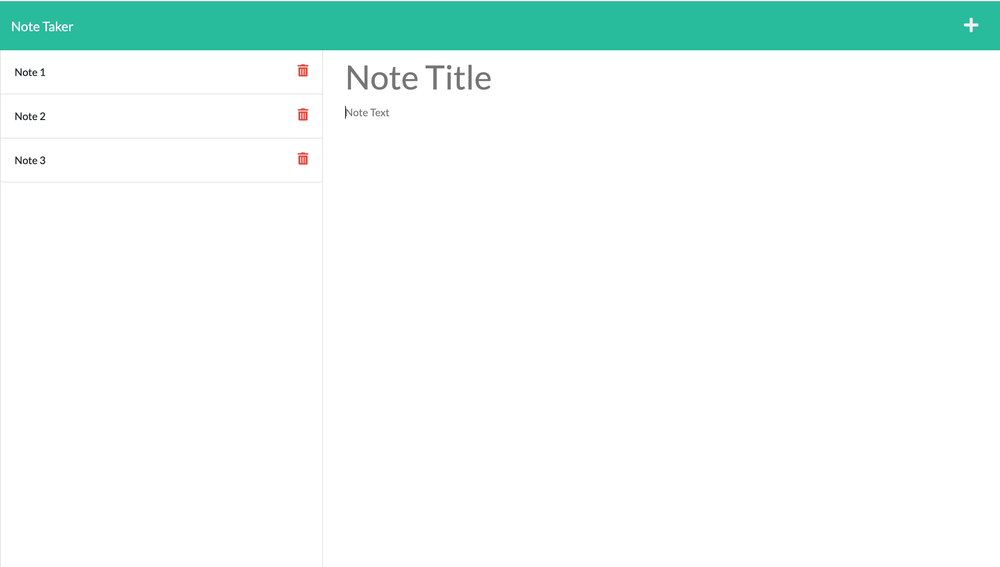

# Note Taker

## Description

The note taker application lets users add notes by entering a title and text for each note. When text is entered for a note, clicking on the save icon will write the note to a json file. Saved notes will show up in the left-hand column, and clicking on one of them will display its content. An existing note can be deleted by clicking on the trash can icon on the note. Clicking on the plus icon in the top nav will display blank fields to enter a title and text for a new note. 

The app is built with Express and deployed on Heroku.

[https://secure-escarpment-64618.herokuapp.com/](https://secure-escarpment-64618.herokuapp.com/)

## Tools
- [Express JS](http://expressjs.com)
- [Heroku](https://www.heroku.com)
- [UUID](https://www.npmjs.com/package/uuid)